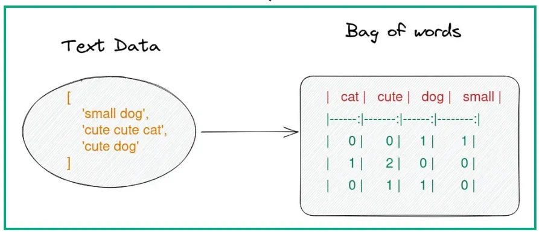

# LahoreChatter
A chatbot which gives the user information on Lahore (Pakistan) and its history.

[](https://www.youtube.com/watch?v=Zh3Ws9C13eI)

[](https://www.youtube.com/watch?v=Zh3Ws9C13eI)

## Overview 

This chatbot uses Natural Language Processing (NLP) fundamentals that I learnt via DataCamp courses. Steps include:

### 1) Text Pre-Processing with NLTK

**Tokenization:** This is the process of breaking down the raw text into smaller components, such as sentences and words. This step converts a large text block into manageable pieces. 

For example, the sentence "Hello, how are you?" is tokenized into ["Hello", ",", "how", "are", "you", "?"].

**Removing Noise and Stop Words:** Noise refers to unnecessary or irrelevant parts of the text that do not contribute to the analysis, such as punctuation and special characters. Stop words are common words like "and," "the," or "is" that are often removed because they do not carry significant meaning. 

**Stemming:** Stemming reduces words to their root form by chopping off prefixes or suffixes. For example, "running" becomes "run." This process can be less precise than lemmatization and may not always produce meaningful words.

**Lemmatization:** Unlike stemming, lemmatization reduces words to their base or dictionary form by considering the context and part of speech. For instance, "running" is lemmatized to "run," and "better" to "good." 

"am," "are," and "is" are all lemmatized to "be." and "flies" (noun) and "flew" (verb) are both reduced to "fly."

This process provides more accurate base forms compared to stemming.    

### 2) Creating a Bag of Words

[](https://ayselaydin.medium.com/4-bag-of-words-model-in-nlp-434cb38cdd1b)

The Bag of Words (BoW) model represents text data in a numerical format. It involves creating a matrix where each row corresponds to a document (or sentence) and each column corresponds to a unique word in the corpus. The value in each cell represents the frequency or presence of a word in a document. This model helps in converting text into a format that can be used for further analysis and computation.

### 3) TF-IDF (Term Frequency-Inverse Document Frequency): 

This approach measures the importance of a word in a document relative to its frequency across all documents in the corpus.

**Term Frequency (TF):** Measures how frequently a term occurs in a document.

**Inverse Document Frequency (IDF):** Measures how important a term is by considering how many documents contain it. Words that are common across many documents are given less weight.

The TF-IDF score combines these two metrics to provide a weighted importance of each word in a document. This approach helps in identifying significant words and ignoring common, less informative words.

### 4) Using Cosine Similarity to Find the Chatbot's Appropriate Response

**Cosine Similarity:** This metric calculates the similarity between two vectors by measuring the cosine of the angle between them. In our case, it compares the vector representation of the user's input to the vectors of all pre-existing sentences in the corpus.

The similarity score ranges from -1 to 1, where 1 indicates identical vectors, 0 indicates orthogonal (no similarity), and -1 indicates opposite vectors. We use this similarity score to identify the most relevant sentence from the corpus that best matches the user's input.

## Technolgies

- Python3 (it would not work on previous versions)
- nltk for Natural Language Processing (Tokenization, Stemming, Lemmatization)
- scikit-learn for TF-IDF Vectorization and Cosine Similarity calculation
- Flask for creating a web-app with a UI

## How to Use

1. Clone the repo
```
git clone https://github.com/zoyahammad/LahoreChatter.git
```

2. Install the dependencies

```
pip install -r requirements.txt
```

3. Run the Flask web app

```
flask run
```

Head to http://127.0.0.1:5000/ in your web browser to test the application.

## How to Contribute

To modify the natural language processing, you can modify the src/nlp.py file

To modify the UI/UX, you can modify the HTML/CSS within templates/index.html

Feel free to make a pull request with proposed changes :)

## Next Steps / Potential Imporvements

- Finding or developing a more elaborate corpus (data set) so that the chatbot covers more subtopics and can answer more questions about Lahore.
- Training the machine learning model such that it can effectively handle punctuation marks (e.g., exclamation marks) better.
- Deploying as a live application (which requires a paid domain). The natural language processing libraries are large, which is why free deployment tools are not appropriate for this use-case.


## Youtube Demo:

[LahoreChatter Demo](https://www.youtube.com/watch?v=Zh3Ws9C13eI)
